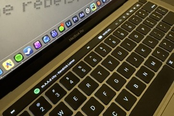

# MTMR Touch Bar Config

A custom Touch Bar layout for [MTMR](https://github.com/Toxblh/MTMR) (My TouchBar, My Rules) on a MacBook Pro. It puts Spotify controls, a battery readout, and gesture shortcuts on the Touch Bar.

I learned the MTMR preset format from community presets on GitHub, then adapted and extended them with my own AppleScript and shell logic.

## Features

**Spotify (left side)**
- Previous and next track buttons.
- A centre button that shows the current track and artist, refreshing every half second. Tapping it toggles play/pause.
- It handles three states: playing (shows track and artist), paused, and Spotify not running (tapping launches Spotify).

**Battery (right side)**
- Runs `pmset -g batt` and pulls the time remaining out of the output with `grep`.
- Shows `HH:MM left.` while discharging, `HH:MM until full.` while charging, `Fully charged.` when done, and `Calculating...` while macOS is still working it out. Refreshes every 60 seconds.
- Tapping it opens [coconutBattery](https://www.coconut-flavour.com/coconutbattery/).

**System keys**
- Keyboard backlight down/up, screen brightness down/up, mute, volume down/up.

**Gestures**
- Two-finger swipe right: next track. Two-finger swipe left: previous track.
- Three-finger swipe right: skip forward 15 seconds. Three-finger swipe left: skip back 15 seconds.

## Requirements

- A MacBook Pro with a Touch Bar
- [MTMR](https://github.com/Toxblh/MTMR)
- The Spotify desktop app
- coconutBattery (optional, only for the tap-to-open action on the battery button)

## Setup

1. Install MTMR and open it once.
2. Copy the contents of the `icons/` folder into `~/Pictures/MTMR_Icons/` (create the folder if it doesn't exist). The config loads its icons from there, so if you put them elsewhere, update the `filePath` values in `items.json`.
3. Back up your current preset, then replace MTMR's `items.json` with the one from this repo. From the MTMR menu bar icon you can open the preset folder, which is normally `~/Library/Application Support/MTMR/`.
4. MTMR reloads the preset automatically. macOS may ask you to let MTMR control Spotify (and System Events); allow it, or the Spotify buttons won't work.

## Customising

- **Widths and order:** each item has a `width` and an `align`; change them to rearrange the bar.
- **Refresh rates:** `refreshInterval` is in seconds. The Spotify button uses 0.5; raising it to 1 or 2 does less work and looks nearly the same.
- **Actions:** the buttons run short AppleScripts, stored inline in the `source` and `actionAppleScript` fields.

## Credits

- [MTMR](https://github.com/Toxblh/MTMR) by Toxblh and contributors.
- The many community MTMR presets I learned the format from.
- The Spotify logo is a trademark of Spotify AB and is used only to label the Spotify button.
